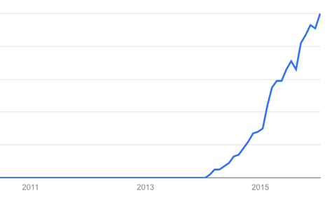
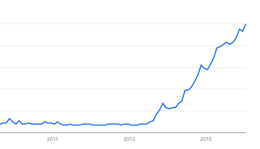
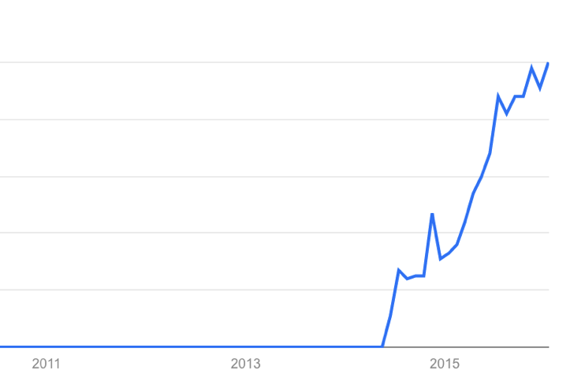
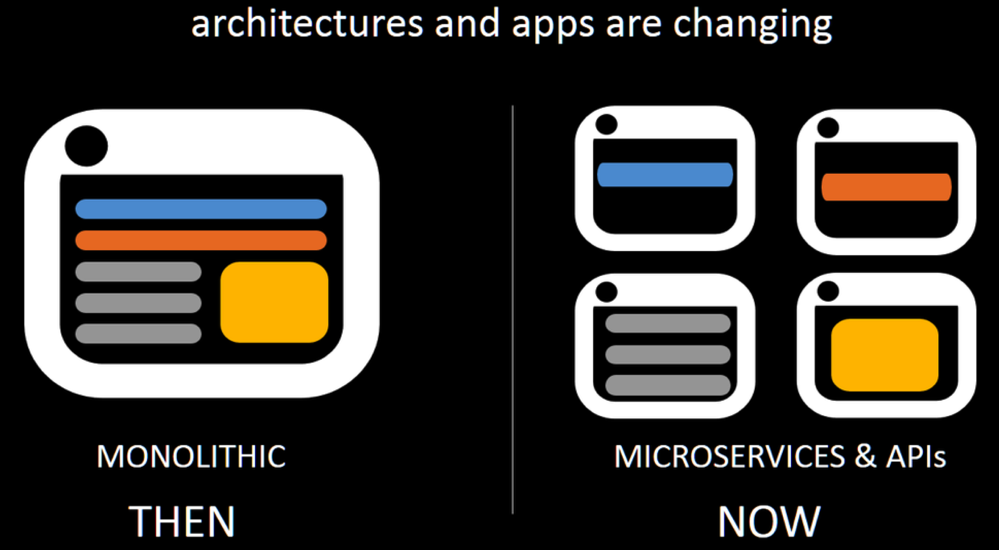
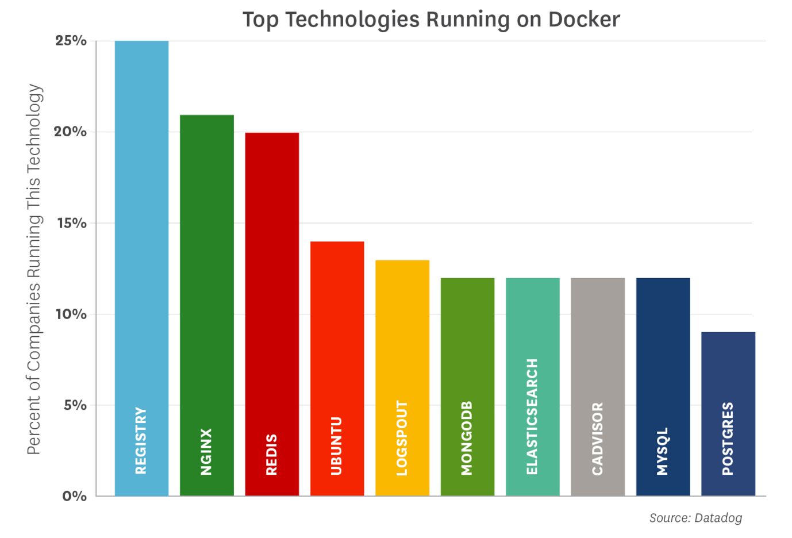
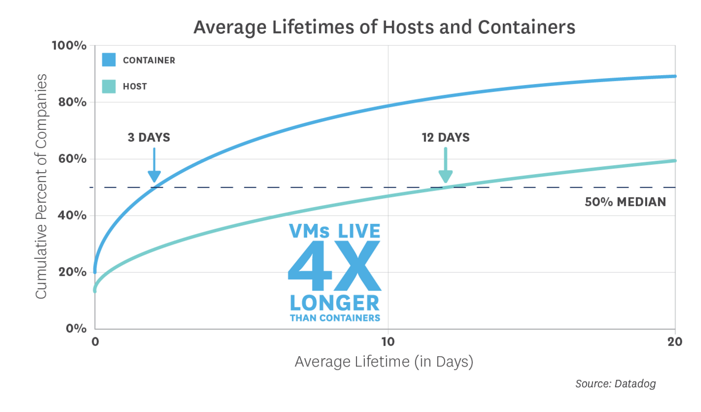
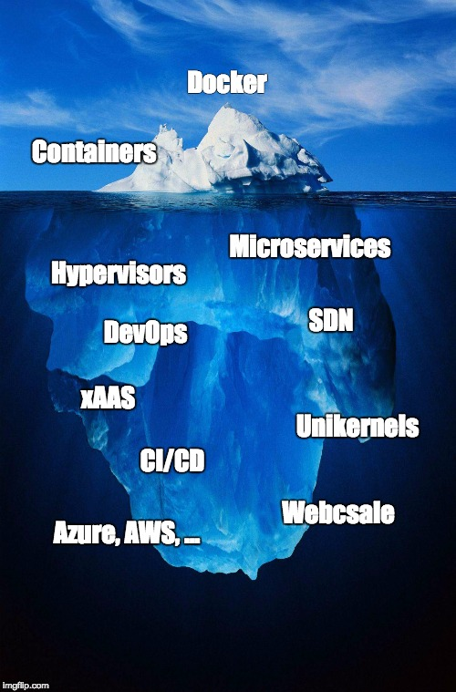

# Introduction

## Why are we here?

We want to help!

Google Trends: "Microservices"

Google Trends:  "Docker"

Google Trends: "Kubernetes"

## Microservices?

*Many development teams have found the microservices architectural style to be a superior approach to a monolithic architecture. But other teams have found them to be a productivity-sapping burden. Like any architectural style, microservices bring costs and benefits. To make a sensible choice you have to understand these and apply them to your specific context.*

Martin Fowler ( http://martinfowler.com/articles/microservice-trade-offs.html)

## Significant benefits
* Support CI/CD practices
* Easier to achieve scale
* Operational benefits of "DevOps"

## DataDog Container Survey

Two schools of thought:
* Containers as up&down microservices
* Containers as "lightweight servers" that stay up

(https://www.datadoghq.com/docker-adoption/)

## What we found

## About us - Fernando

[@fsmontenegro](https://twitter.com/fsmontenegro)

* Sales Engineer
  + Network Security (Micro-segmentation)
* CompSci ’94
* Greying hair

* Curious
  + Finance (DIY)
  + Economics (EMH, Behaviour)
  + Data Science (Coursera)

***

## About us - Ricardo
